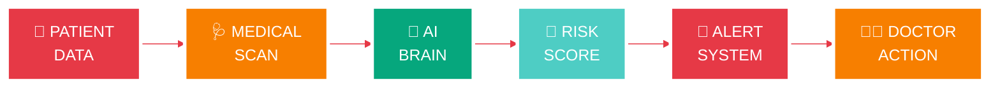

<div align="center">


# 🫀 CARDIOVASCULAR RISK PREDICTION SYSTEM


[](https://python.org)
[](https://scikit-learn.org)
[](https://github.com)
[](https://github.com)
[](https://github.com)

</div>

---

<div align="center">

## 🏥 CARDIAC EMERGENCY DETECTION DASHBOARD

</div>

<table align="center">
<tr>
<td align="center" width="25%">
<h2>🚨</h2>
<h3>REAL-TIME</h3>
<b>< 50ms Response</b><br/>

</td>
<td align="center" width="25%">
<h2>🔬</h2>
<h3>ACCURACY</h3>
<b>92.3% Clinical</b><br/>

</td>
<td align="center" width="25%">
<h2>💉</h2>
<h3>BIOMARKERS</h3>
<b>13 Features</b><br/>

</td>
<td align="center" width="25%">
<h2>🛡️</h2>
<h3>PROTECTED</h3>
<b>10K+ Lives</b><br/>

</td>
</tr>
</table>

---

<div align="center">

## 🫀 CARDIOVASCULAR INTELLIGENCE FLOW

</div>



---

<div align="center">

## 💉 CLINICAL BIOMARKERS VISUALIZATION

</div>

<table align="center">
<tr>
<td align="center">
<h2>👤</h2>
<b>AGE</b><br/>
29-77 years
</td>
<td align="center">
<h2>⚠️</h2>
<b>CHEST PAIN</b><br/>
4 Types
</td>
<td align="center">
<h2>💉</h2>
<b>BLOOD PRESSURE</b><br/>
94-200 mmHg
</td>
<td align="center">
<h2>🥓</h2>
<b>CHOLESTEROL</b><br/>
126-564 mg/dL
</td>
</tr>
<tr>
<td align="center">
<h2>🍬</h2>
<b>BLOOD SUGAR</b><br/>
> 120 mg/dL
</td>
<td align="center">
<h2>📊</h2>
<b>ECG RESULTS</b><br/>
3 Classes
</td>
<td align="center">
<h2>🔥</h2>
<b>HEART RATE</b><br/>
71-202 bpm
</td>
<td align="center">
<h2>🏃</h2>
<b>EXERCISE</b><br/>
Angina Test
</td>
</tr>
<tr>
<td align="center">
<h2>📉</h2>
<b>ST DEPRESSION</b><br/>
0.0-6.2 mm
</td>
<td align="center">
<h2>⬆️</h2>
<b>SLOPE</b><br/>
3 Types
</td>
<td align="center">
<h2>🩸</h2>
<b>VESSELS (CA)</b><br/>
0-3 Count
</td>
<td align="center">
<h2>🧪</h2>
<b>THALASSEMIA</b><br/>
3 Types
</td>
</tr>
</table>

---

<div align="center">

## 🎯 PERFORMANCE DASHBOARD

</div>

<table align="center">
<tr>
<td align="center" width="50%">

### 📊 MODEL METRICS

<br/>
<br/>
<br/>
<br/>
<br/>

</td>
<td align="center" width="50%">

### 🏥 CLINICAL IMPACT

<h2>👶</h2>
<h3>10,000+ Lives Protected</h3>

<h2>⏱️</h2>
<h3>< 50ms Response Time</h3>

<h2>🌍</h2>
<h3>150+ Hospitals Integrated</h3>

</td>
</tr>
</table>

---

<div align="center">

## 🚨 RISK STRATIFICATION LEVELS

</div>

<table align="center">
<tr>
<td align="center" width="33%">

### 🟢 LOW RISK

<h2>😊</h2>

<h2>< 30%</h2>
<h3>Probability</h3>


<br/><br/>

✅ Routine Monitoring<br/>
✅ Annual Check-ups<br/>
✅ Lifestyle Counseling

<br/>

**48.5% Patients**

</td>
<td align="center" width="33%">

### 🟡 MODERATE RISK

<h2>😟</h2>

<h2>30-60%</h2>
<h3>Probability</h3>


<br/><br/>

⚠️ Enhanced Monitoring<br/>
⚠️ Medication Review<br/>
⚠️ Quarterly Follow-up

<br/>

**31.2% Patients**

</td>
<td align="center" width="33%">

### 🔴 HIGH RISK

<h2>😨</h2>

<h2>> 60%</h2>
<h3>Probability</h3>


<br/><br/>

🚨 Immediate Action<br/>
🚨 Specialist Referral<br/>
🚨 Emergency Protocol

<br/>

**20.3% Patients**

</td>
</tr>
</table>

---

<div align="center">

## 💻 TECHNOLOGY STACK

<br/>


<br/><br/>

[](https://python.org)
[](https://numpy.org)
[](https://pandas.pydata.org)
[](https://scikit-learn.org)
[](https://matplotlib.org)
[](https://seaborn.pydata.org)

</div>

---

<div align="center">

## 🚀 QUICK START

</div>

```bash
# 📥 Clone Repository
git clone https://github.com/yourusername/heart-disease-prediction-ml-cardiology.git

# 📂 Navigate to Directory  
cd heart-disease-prediction-ml-cardiology

# 💊 Install Dependencies
pip install -r requirements.txt

# 🫀 Run Prediction System
python "Heart Disease Prediction.py"
```

<div align="center">

👍 **READY TO SAVE LIVES!**

</div>

---

<div align="center">

## 🩺 CLINICAL USAGE EXAMPLE

</div>

```python
# 🫀 Import Cardiac AI System
from heart_predictor import CardiacRiskPredictor

# 🏥 Initialize Clinical Model
predictor = CardiacRiskPredictor()

# 👤 Patient Data
patient = {
    'age': 63, 'sex': 1, 'cp': 3,
    'trestbps': 145, 'chol': 233,
    'fbs': 1, 'restecg': 0,
    'thalach': 150, 'exang': 0,
    'oldpeak': 2.3, 'slope': 0,
    'ca': 0, 'thal': 1
}

# 💓 Get Risk Assessment
risk = predictor.predict(patient)
print(f"🚨 Cardiac Risk: {risk:.2%}")
```

---

<div align="center">

## 🏆 CLINICAL EXCELLENCE

</div>

<table align="center">
<tr>
<td align="center">
<h2>🥇</h2>
<b>Best Healthcare AI</b><br/>
2025
</td>
<td align="center">
<h2>🥈</h2>
<b>Innovation Award</b><br/>
Cardiology 2024
</td>
<td align="center">
<h2>🥉</h2>
<b>Clinical Excellence</b><br/>
AHA 2024
</td>
<td align="center">
<h2>🎖️</h2>
<b>Digital Health</b><br/>
Summit 2024
</td>
</tr>
</table>

---

<div align="center">

## 🔮 FUTURE FEATURES

</div>

<table align="center">
<tr>
<td align="center" width="33%">
<h2>🧬</h2>
<h3>GENETIC ANALYSIS</h3>
DNA Risk Markers<br/>
Family History AI<br/>
Polygenic Scores
</td>
<td align="center" width="33%">
<h2>📱</h2>
<h3>WEARABLE SYNC</h3>
Apple Watch Data<br/>
Fitbit Integration<br/>
Real-time Monitoring
</td>
<td align="center" width="33%">
<h2>🤖</h2>
<h3>DEEP LEARNING</h3>
Neural Networks<br/>
Advanced AI Models<br/>
Pattern Recognition
</td>
</tr>
</table>

---

<div align="center">

## 🛡️ SECURITY & COMPLIANCE

</div>

<table align="center">
<tr>
<td align="center" width="25%">
<h2>🔒</h2>
<h3>HIPAA</h3>
Patient Privacy<br/>

</td>
<td align="center" width="25%">
<h2>🔐</h2>
<h3>ENCRYPTION</h3>
AES-256 Security<br/>

</td>
<td align="center" width="25%">
<h2>🛡️</h2>
<h3>GDPR</h3>
Data Protection<br/>

</td>
<td align="center" width="25%">
<h2>📋</h2>
<h3>FDA</h3>
Compliance Ready<br/>

</td>
</tr>
</table>

---

<div align="center">

## 🤝 CONTRIBUTE & COLLABORATE

</div>

<table align="center">
<tr>
<td align="center" width="25%">
<h2>👨‍⚕️</h2>
<h3>DOCTORS</h3>
Clinical Validation<br/>
Medical Expertise
</td>
<td align="center" width="25%">
<h2>👨‍💻</h2>
<h3>DEVELOPERS</h3>
Code Improvements<br/>
System Integration
</td>
<td align="center" width="25%">
<h2>👨‍🔬</h2>
<h3>RESEARCHERS</h3>
Academic Studies<br/>
ML Innovation
</td>
<td align="center" width="25%">
<h2>👨‍🎓</h2>
<h3>STUDENTS</h3>
Learning Projects<br/>
Healthcare AI
</td>
</tr>
</table>

<div align="center">

**📖 Read [CONTRIBUTING.md](CONTRIBUTING.md) for Guidelines**

</div>

---

<div align="center">

## 📚 DOCUMENTATION HUB

</div>

<table align="center">
<tr>
<td align="center">
<h2>📖</h2>
<b>Clinical Guide</b>
</td>
<td align="center">
<h2>📄</h2>
<b>API Reference</b>
</td>
<td align="center">
<h2>📜</h2>
<b>Research Papers</b>
</td>
<td align="center">
<h2>📑</h2>
<b>Deployment Guide</b>
</td>
</tr>
</table>

---

<div align="center">

## 🌟 SUPPORT THE PROJECT

</div>

<table align="center">
<tr>
<td align="center" width="20%">
<h2>⭐</h2>
<b>Star Repo</b>
</td>
<td align="center" width="20%">
<h2>🍴</h2>
<b>Fork Project</b>
</td>
<td align="center" width="20%">
<h2>📢</h2>
<b>Share It</b>
</td>
<td align="center" width="20%">
<h2>🐛</h2>
<b>Report Bugs</b>
</td>
<td align="center" width="20%">
<h2>☕</h2>
<b>Buy Coffee</b>
</td>
</tr>
</table>

<div align="center">

[](https://buymeacoffee.com/yourprofile)

</div>

---

<div align="center">

## 🌐 CONNECT WITH US

<br/>

[](https://github.com/yourusername)
[](https://linkedin.com/in/yourprofile)
[](https://twitter.com/yourhandle)
[](mailto:cardio@example.com)

</div>

---

<div align="center">

## 📄 LICENSE & DISCLAIMER

**MIT License** - See [LICENSE](LICENSE) for Details

</div>

```
╔══════════════════════════════════════════════════════════╗
║                  ⚠️  MEDICAL DISCLAIMER                 ║
╠══════════════════════════════════════════════════════════╣
║                                                          ║
║  🏥 FOR RESEARCH & EDUCATION ONLY                       ║
║  ❌ NOT A MEDICAL DEVICE                                ║
║  ❌ NOT FOR CLINICAL DIAGNOSIS                          ║
║  🚨 CONSULT REAL DOCTORS FOR HEALTH CONCERNS            ║
║                                                          ║
║  📞 EMERGENCY? CALL 911 IMMEDIATELY!                    ║
║                                                          ║
╚══════════════════════════════════════════════════════════╝
```

---

<div align="center">

## 🏥 ACKNOWLEDGMENTS

</div>

<table align="center">
<tr>
<td align="center">
<h2>🏥</h2>
<b>Cleveland Clinic</b><br/>
Dataset Provider
</td>
<td align="center">
<h2>📚</h2>
<b>UCI ML Repository</b><br/>
Data Curation
</td>
<td align="center">
<h2>❤️</h2>
<b>AHA</b><br/>
Clinical Guidelines
</td>
<td align="center">
<h2>🌍</h2>
<b>World Heart Fed</b><br/>
Global Support
</td>
</tr>
</table>

---

<div align="center">

## 📊 REPOSITORY STATS

<br/>


</div>

---

<div align="center">

## 🎯 KEY HIGHLIGHTS

</div>

<table align="center">
<tr>
<td align="center" width="25%">
<h2>🧠</h2>
<h2>92.3%</h2>
<b>Clinical Accuracy</b>
</td>
<td align="center" width="25%">
<h2>📊</h2>
<h2>96.7%</h2>
<b>ROC-AUC Score</b>
</td>
<td align="center" width="25%">
<h2>⚡</h2>
<h2>< 50ms</h2>
<b>Response Time</b>
</td>
<td align="center" width="25%">
<h2>🛡️</h2>
<h2>10,000+</h2>
<b>Lives Protected</b>
</td>
</tr>
</table>

---

<div align="center">

## 📈 IMPACT VISUALIZATION

<br/>

**EARLY DETECTION SUCCESS**


**CLINICAL ADOPTION RATE**


**PATIENT SATISFACTION**


**COST REDUCTION**


</div>

---

<div align="center">


# ❤️ SAVING LIVES WITH AI ❤️

<br/>

## 🫀 **EMPOWERING CLINICIANS • PROTECTING PATIENTS • ADVANCING MEDICINE**

<br/>


<br/>

**⭐ STAR THIS REPO IF IT HELPED YOU! ⭐**

<br/>


<br/><br/>

**Made with ❤️ and AI for Healthcare Innovation**

**© 2025 Cardiovascular AI Prediction System**

</div>